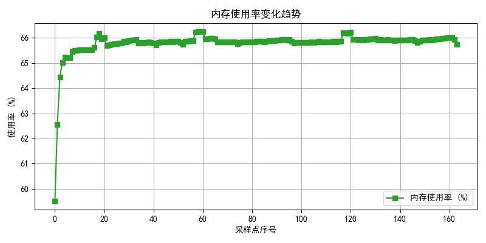
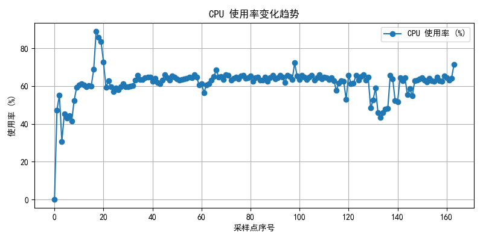
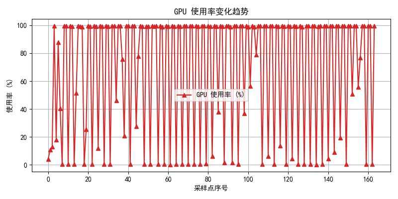

# FaceTrack Gimbal

🚀 **实时人脸跟踪云台系统 | Embedded AI + Robotics Demo**

------

## 📷 演示


------

## 📈 系统性能示例

内存使用率：




CPU 使用率：




GPU 使用率：




------

## 🏗️项目结构

```
本项目项目结构如下：
face_track_gimbal/
 │
 ├─ scripts/           # Python 脚本：模型推理、调试、偏移量计算与可视化
 │   ├─ 0_yolo5_inference_demo.py
 │   ├─ 1_extract_fp16.py
 │   ├─ 2_compare_FP32_and_FP16.py
 │   └─ ...
 │
 ├─ face_track_ctrl/   # Jetson Nano C++ 项目
 │   ├─ app.cpp / app.h
 │   ├─ camera.cpp / camera.h
 │   ├─ yolo_onnx_runtime.cpp / .h
 │   └─ ...
 │
 └─ servo_control/     # STM32F103C8T6 项目，舵机控制
 	├─ main.c
	├─ timer.c / timer.h
	└─ ...
```

------

##  💡 项目亮点

- 🎯 **实时人脸检测与跟踪**：Jetson Nano 上运行 YOLOv5 ONNX 模型，支持 CUDA/TensorRT 加速。  

- ⚙️ **云台伺服控制**：偏移量通过串口发送给 STM32F103C8T6，驱动双轴舵机。  

  ​								 阈值过滤避免小幅抖动，提升跟踪稳定性。

- 🧵 **多线程架构**：视频采集、深度学习推理、偏移量计算、可视化和系统监控分离线程并行执行。  

  ​							 线程安全队列保证生产者-消费者模型高效运行。

- 📊 **系统性能监控**：实时记录 CPU、GPU、内存使用率和温度，具备嵌入式设备运行调优能力。

- 🖼️ **可视化结果**：显示检测框、偏移量和 FPS，便于调试与演示。

- 📜 **工程化实现**：Python + C++ 脚本支持快速实验与验证。  STM32 MCU 驱动实际舵机。

------

## scripts

**scripts**：Python 脚本，用于模型推理、调试、数据处理、模拟偏移量、可视化等，方便在 PC 或 Jetson 上测试。

------

### 🚀 快速开始

```
cd scripts
pip install -r requirements.txt
python 7_face_track_gimbal.py
```

------

## face_track_ctrl

**face_track_ctrl**：C++ 项目，部署在 **Jetson Nano B01**，负责摄像头采集、YOLO 推理、可视化、云台偏移计算和串口通信。

---

### 🏗️ 系统架构

- Camera
  - → YOLO Detector
    - → Result Queue → Visualizer
    - → Offset Queue → Gimbal Controller → Serial Port
    - → Telemetry (CPU/GPU/Mem) → Logger

- **Detector Thread**：执行人脸检测，输出结果。  
- **Visualizer Thread**：绘制检测框、显示 FPS。  
- **Gimbal Thread**：计算目标偏移量并驱动舵机。  
- **Telemetry Thread**：采集并记录系统性能指标。  

---

### 📦 环境依赖

- **硬件**
  - NVIDIA Jetson Nano
  - USB Camera
  - 双轴舵机云台（串口控制）
- **软件**
  - C++17
  - OpenCV 4.5.3
  - ONNX Runtime v1.11.0
  - spdlog
  - CMake ≥ 3.18.1

---

### 🚀 快速开始

1. 克隆仓库：

   ```bash
   git clone https://github.com/yourname/FaceTrackGimbal.git
   cd face_track_ctrl
   ```

2. 编译项目：

   ```
   mkdir build && cd build
   cmake ..
   make -j4
   ```

3. 运行程序

   ```
   ./FaceTrackGimbal
   ```

------

## servo_control

**servo_control**：STM32F103C8T6 上的舵机控制代码，接收偏移量并驱动云台。

------

### 🚀 快速开始

- 使用 STM32CubeIDE 编译 `servo_control` 项目并烧录 MCU。

------

## 🔮 TODO / 改进方向

-  支持更多目标检测
-  增加 Web 前端远程控制功能
-  模型量化与 TensorRT 加速，进一步提升 FPS
-  增加 UI 控制面板，增强交互体验

------

## 📜 License

MIT License

------

## 👤 作者

- **Leonard ZHOU**
  - Email: 17301817631@163.com


